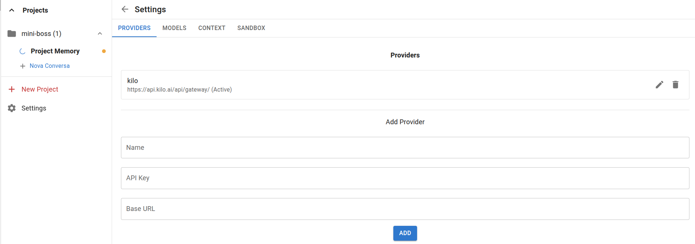
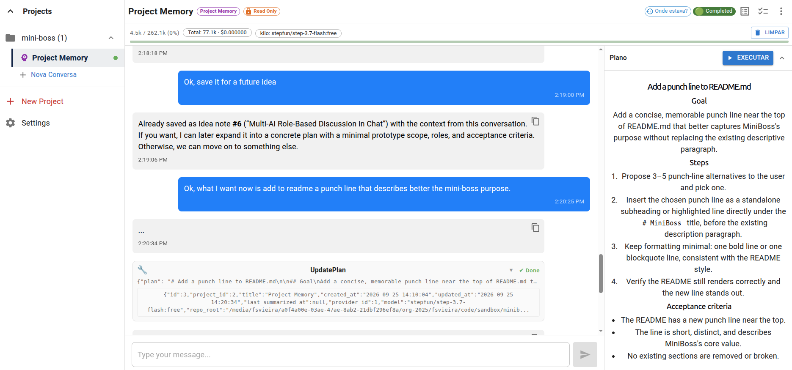
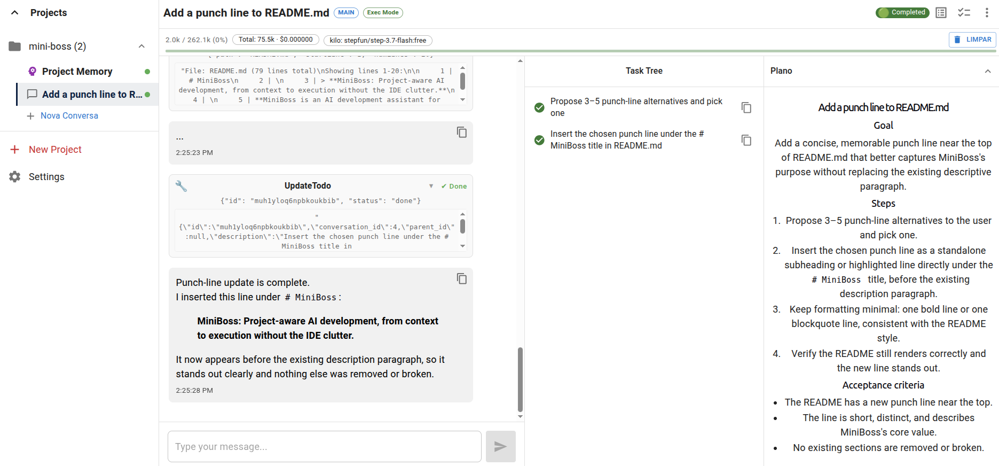
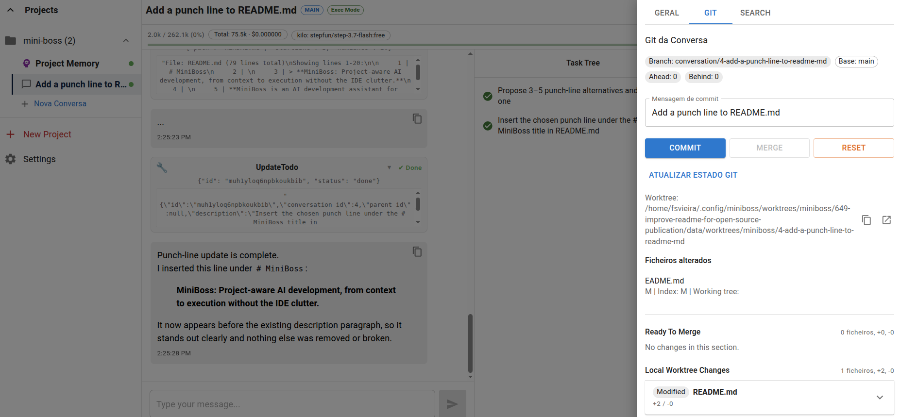

# MiniBoss

**MiniBoss is a project-aware AI development assistant for working across multiple Git projects without switching IDEs.** It combines persistent project memory, isolated Git worktrees, and a sandboxed execution environment so you can plan, implement, and review work from one place.

Every project you add to MiniBoss must already be a Git repository.

> **Notice:** MiniBoss is under active development. It may contain bugs or breaking changes. You are welcome to try it, but use it with care.

## Security

MiniBoss uses Git worktrees together with a bubblewrap (`bwrap`) sandbox to limit the assistant's access:

- The assistant operates inside the active worktree. Filesystem and command access are restricted to that worktree, so nothing is written outside it from within an execution conversation.
- The base repository is only modified through explicit Git operations that you initiate in the Git section.

However, this boundary is **not absolute**:

- If the assistant invokes external services—such as a MySQL database, remote APIs, or other networked tools—those interactions are **not** confined by the worktree sandbox. The sandbox controls filesystem and process isolation within the worktree; it does not restrict outbound connections or external state changes.

Also note that the bubblewrap sandbox is currently **Linux-only** and requires `bwrap` to be installed. MiniBoss verifies this on startup and will not run without it.

## Features

- **Project memory** — persistent notes about decisions, architecture, pending work, and context across sessions.
- **Worktree isolation** — implementation work happens in dedicated Git worktrees, keeping changes separate from your main branch and from other tasks.
- **Sandboxed execution** — the assistant operates inside the active worktree, with filesystem and command access restricted by project settings.
- **Settings & providers** — configurable sandbox rules, tool providers, and per-project behavior.
- **Execution conversations** — focused sessions for modifying, testing, and reviewing code with approval gates.
- **Git operations** — inspect, commit, merge, and manage branches from within execution conversations.

## Screenshots

> Add real images later. For now, these placeholders show the intended screens.


*Project settings, sandbox controls, and provider configuration.*


*Persistent project memory alongside plan and execute workflows.*


*Focused execution session with TODO list and embedded plan.*


*Reviewing code changes, commit, and merge inside an execution conversation.*

## Quick Start

### Prerequisites

- Node.js v18+
- npm

### Install

```bash
npm install
cd server && npm install
cd ../web && npm install
```

### Run

```bash
cd server
npm run start
```

Then open the web client:

```bash
cd web
npm run dev
```

For a production build of the frontend:

```bash
cd web
npm run build
```

## Contributing

See [CONTRIBUTING.md](CONTRIBUTING.md) for setup, workflow, and pull request guidelines.

## License

MIT — see [LICENSE](LICENSE) for details.
